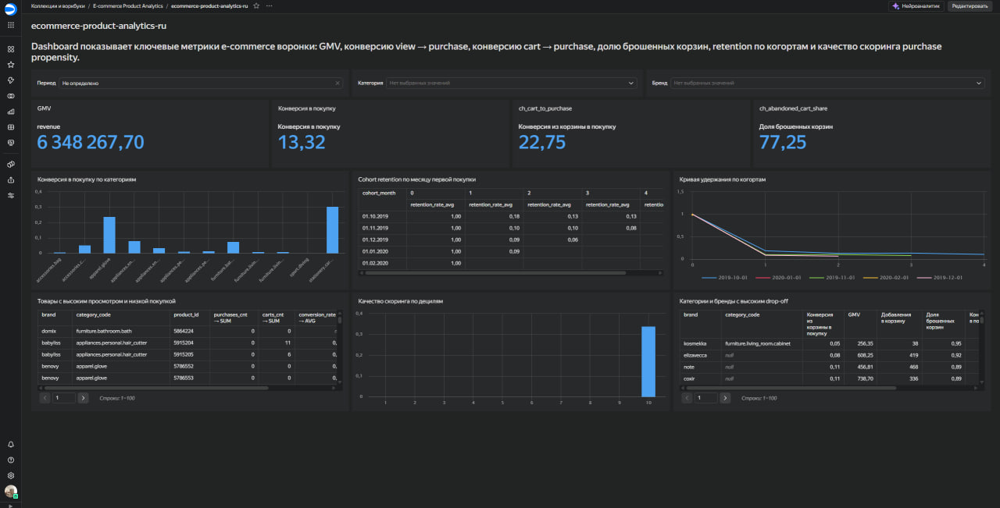

# Product Funnel & Retention Command Center for E-commerce

## Описание проекта

Проект посвящен продуктовой аналитике e-commerce event-data. В нем реализованы ETL, SQL-витрины, sessionization, анализ воронки `view -> cart -> purchase`, cohort retention, сегментация пользователей, baseline purchase propensity model и BI-dashboard в Yandex DataLens.

Цель проекта — показать полный аналитический workflow: от сырых событий до витрин, ноутбуков, модели скоринга и dashboard для бизнес-интерпретации.

## Бизнес-вопрос

Где пользователи теряются в воронке, какие категории и бренды имеют высокий drop-off, как меняется retention по когортам и как можно приоритизировать сессии с высокой вероятностью покупки?

## Данные

Используются публичные e-commerce event-data. Сырые данные не хранятся в репозитории и должны быть помещены вручную в `data/raw/`.

Ожидаемые поля входных CSV:

- `event_time`
- `event_type`
- `product_id`
- `category_id`
- `category_code`
- `brand`
- `price`
- `user_id`
- `user_session`

## Структура проекта

- `data/raw/` — сырые CSV-файлы, добавляются вручную.
- `data/processed/` — очищенный parquet после ETL.
- `data/marts/` — DuckDB-база, аналитические витрины и CSV для BI.
- `sql/` — SQL-скрипты для фактов и витрин.
- `notebooks/` — аналитические ноутбуки.
- `src/ecommerce_analytics/` — Python-пакет проекта.
- `tests/` — pytest-тесты.
- `reports/` — бизнес-резюме, спецификация dashboard, метрики модели.
- `bi/datalens/` — инструкция по ручной сборке dashboard в Yandex DataLens.
- `assets/` — screenshots dashboard для README и портфолио.

## ETL

ETL читает сырые CSV-файлы из `data/raw/`, объединяет события, очищает типы, приводит `event_time` к datetime, приводит `price` к float, удаляет полные дубли, фильтрует некорректные цены, проверяет обязательные колонки и сохраняет processed parquet:

```text
data/processed/events_clean.parquet
```

Команда:

```powershell
python scripts/run_etl.py
```

## SQL-витрины

SQL-слой строится в DuckDB на основе `data/processed/events_clean.parquet`.

Основные витрины:

- `fct_events` — очищенный событийный факт.
- `fct_sessions` — сессионный факт с метриками глубины, длительности, корзины, покупки и выручки.
- `mart_funnel_daily` — дневная воронка по категориям и брендам.
- `mart_retention` — cohort retention по месяцу первой покупки.
- `mart_product_conversion` — конверсия и выручка по товарам.

Команда:

```powershell
python scripts/build_marts.py
```

## Аналитика

Аналитический слой включает:

- KPI overview;
- funnel analysis;
- category / brand conversion;
- cohort retention;
- product conversion;
- segmentation.

Основной ноутбук:

```text
notebooks/01_product_analysis.ipynb
```

## Модель purchase propensity

Модель ранжирует сессии по вероятности покупки. Используется time-based validation по `session_start`, без random split.

Модель используется для приоритизации сессий на основе уже наблюдаемого поведения в рамках сессии.

Команда:

```powershell
python scripts/train_propensity_model.py
```

Результаты сохраняются в:

```text
reports/propensity_metrics.json
data/marts/propensity_scores.parquet
```

## BI-dashboard

Dashboard собран в Yandex DataLens. Он показывает управленческий и аналитический слой проекта.

Основные блоки:

- GMV;
- конверсия в покупку;
- конверсия из корзины в покупку;
- доля брошенных корзин;
- конверсия по категориям;
- категории и бренды с высоким drop-off;
- cohort retention;
- кривая удержания по когортам;
- качество скоринга по децилям.



CSV для ручной сборки dashboard в Yandex DataLens готовятся командой:

```powershell
python scripts/export_for_datalens.py
```

Инструкция по ручной сборке:

```text
bi/datalens/datalens_setup_guide.md
```

## Как запустить проект

```powershell
pip install -r requirements.txt
python scripts/run_etl.py
python scripts/build_marts.py
python scripts/train_propensity_model.py
python scripts/export_for_datalens.py
python -m pytest
```

## Ограничения анализа

- Анализ не доказывает causal uplift.
- Выводы основаны на публичных данных.
- Dashboard показывает аналитические и сценарные выводы.
- Эффект рекомендаций нужно проверять через эксперимент или дополнительные данные.
- В проекте нет полного бизнес-контекста по скидкам, доставке, остаткам, рекламным кампаниям и изменениям интерфейса.

## Дальнейшие улучшения

- Добавить A/B-test design для проверки гипотез.
- Расширить модель без leakage.
- Добавить больше user-level features.
- Автоматизировать обновление BI-витрин.
